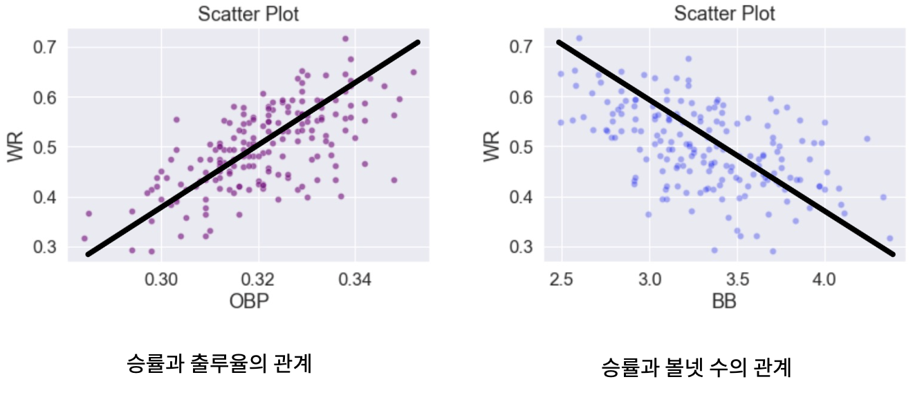

# MLB Winning Rate Regression

Category: BigData Analysis

<aside>
💡 주제 

</aside>

> **MLB(메이저리그 야구) 스탯 및 승률 데이터와 회귀 분석을 활용한 승률 예측**
> 
> 
> Prediction of win rate using MLB (Major League Baseball) stat and win rate data and regression analysis
> 

<aside>
💡 데이터

6년간 30개 팀의 데이터 → 총 180개의 데이터

</aside>

> Tm 변수 : 연도별로 각 팀을 나눈 것
> 
> HR 변수 : 홈런 비율
> 
> CS 변수 : 도루 실패 비율
> 
> BA 변수 : 타율
> 
> OBP 변수 : 출루율
> 
> GDP 변수 : 병살타 비율
> 
> SF 변수 : 희생 플라이 비율
> 
> WR 변수 : 승률 비율 (타겟 변수)
> 
> ERR 변수 : 실책 비율
> 
> ERA 변수 : 평균 자책점
> 
> BB 변수 : 볼넷 개수
> 
> Team 변수 : 팀의 이름
> 

<aside>
💡 Heatmap

</aside>

OBP (출루율) : 양의 상관 관계, 0.66

BB (볼넷 수) : 음의 상관 관계, -0.52

<aside>
☝ 승률과 출루율은 양의 상관 관계를 보이므로 출루율이 높은 팀들이 상대적으로 높은 승률을 보임

</aside>

<aside>
☝ 승률과 볼넷 개수는 음의 상관 관계를 보이므로 볼넷의 수가 많은 팀들이 상대적으로 낮은 승률을 보임

</aside>

<aside>
💡 팀별 데이터

</aside>

<aside>
💡 팀별 승률과 팀별 실책율 간의 관계

</aside>

위의 팀별 승률과 실책률을 겹쳐보면 보편적으로 실책률이 높은 팀의 승률이 낮은 것을 알 수 있다.

<aside>
💡 훈련 데이터(training data) : 테스트 데이터(test data) ⇒ 8 : 2 비율

**다중 공선성이 있는 변수들은 제거해주기**

</aside>

- VIF 지수가 10 이상인 변수들을 제거하고 난 결과 최종적으로 왼쪽 위의 사진과 같은 결과 도출

- 절댓값을 기준으로 회귀 계수를 크기 순서대로 나열한 결과 왼쪽 아래의 사진과 같은 결과 도출
    - OBP(Positive) > BB(Negative) > HR(Positive) > ERA(Negative) > ERR(Negative) > GDP(Negative) > SF(Positive) > BA(Negative) > CS(Negative)

**P>|t|**
- 0.05보다 작아야 유의미 → CS, BA, SF 는 그 값보다 큰 값에 해당하므로 유의미하지 않은 값들이다.**

**R-squared**
- 높을수록 신뢰성 있는 데이터를 의미하며 0.714 값을 가짐**

**해석**
- HR 과 OBP 변수는 다른 변수의 값이 고정되었을 때 해당 값이 클수록 승률이 높을 것임을 예측 가능
- GDP, ERR, ERA, BB는 다른 변수의 값이 고정되었을 때 해당 값이 작을수록 승률이 높을 것임을 예측 가능

<aside>
💡 결과 분석 (Result Analysis)

</aside>

**R-square** : 0.75
**RMSE** : 0.04

- HR 과 OBP 변수는 다른 변수의 값이 고정되었을 때 해당 값이 클수록 승률이 높을 것임을 예측 가능
- GDP, ERR, ERA, BB는 다른 변수의 값이 고정되었을 때 해당 값이 작을수록 승률이 높을 것임을 예측 가능

**- 팀별 요소 분석 결과 보편적으로 실책률이 낮을 때 승률이 상승**